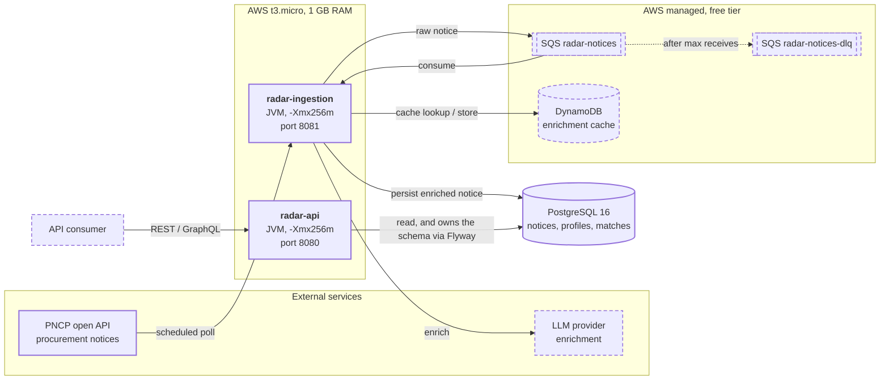

# Architecture

Target architecture of radar-pncp and the honest state of it today. This file is updated at the
end of every roadmap stage: a box moves from *planned* to *built* only when there is a test
proving it.

## Target architecture

Solid boxes exist and are covered by tests. Dashed boxes are planned and not implemented yet.

## What exists today, after stage 03

| Component | State | Evidence |
| --- | --- | --- |
| `radar-domain` | Model, five scoring rules, scoring engine, three ports | 71 tests, including seeded invariants for the 0-100 bound and determinism |
| `radar-shared` | Empty on purpose, purity enforced | `SharedContractsPurityTest`, enforcer `enforce-shared-purity` |
| `radar-api` | Boots, Flyway migrates, actuator answers | `RadarApiApplicationIT`, 4 tests against real PostgreSQL 16 |
| `radar-ingestion` | PNCP adapter: fetches, maps, bounded fan out | 66 tests, including a live smoke test run manually against real PNCP |
| PostgreSQL 16 | Running in `docker-compose.yml`, one smoke migration | `V1__create_schema_version_smoke_table.sql` |

### Measured footprint

Taken with `docker stats` against the compose stack, all three containers healthy and idle:

| Container | Resident | Container limit |
| --- | --- | --- |
| `radar-api` | 141.5 MiB | 320 MiB |
| `radar-ingestion` | 124.1 MiB | 320 MiB |
| `radar-postgres` | 43.0 MiB | 256 MiB |
| **Total** | **308.6 MiB** | 896 MiB |

That is the idle floor with no business logic in either service, measured on a developer machine
where PostgreSQL shares the host. It is the number every later stage is measured against: if a
feature moves it materially, the feature pays for itself or it does not ship.

The domain is framework free and enforced twice, by the maven-enforcer-plugin on the dependency
tree and by `DomainPurityTest` on the imports. Both checks now run against real classes rather
than an empty module.

Not started: the scheduler, SQS and its dead letter queue, LLM enrichment, the DynamoDB cache,
persistence of any kind, GraphQL, auth and the EC2 deployment. `ProcurementSource` is implemented;
`MatchRepository` and `EnrichmentProvider` are still declarations with no implementation anywhere.

## Constraints that shape the design

These are not preferences; they decide what may and may not be added.

- **1 GB of RAM, two JVMs at 256 MB each.** No second database engine, no in-process message
  broker, no agent that wants its own heap. The remaining memory belongs to the OS and to
  PostgreSQL while it runs on the same box.
- **AWS free tier only.** No EKS, no ALB, no NAT Gateway, no Fargate. Queueing is SQS, the cache
  is DynamoDB, compute is one EC2 instance.
- **The domain is framework free.** See
  [ADR 0002](adr/0002-bom-import-and-enforced-domain-purity.md).
- **Capability outranks geography.** Weights are data, a closed deadline disqualifies rather
  than scoring low, and a criterion nobody could evaluate is reported as coverage rather than
  as a penalty. See [ADR 0004](adr/0004-closed-segment-vocabulary-instead-of-cnae-inference.md)
  and [ADR 0005](adr/0005-scoring-weights-disqualification-and-time.md).
- **PNCP timestamps are naive.** They are read as America/Sao_Paulo at the adapter boundary and
  the domain only ever sees `Instant`.
- **`radar-api` owns the schema.** Flyway lives in `radar-api` and nowhere else, so there is
  exactly one writer of migrations even once `radar-ingestion` also writes rows.

## Why SQS sits between the two services

Ingestion is bursty and slow: PNCP pagination, then an LLM call per notice with its own latency
and failure modes. Queries are neither. Separating them means a slow enrichment run cannot make
the query service unresponsive, a failed LLM call is retried rather than lost, and the dead
letter queue makes "failed repeatedly" a visible state instead of a silence in a log file.
